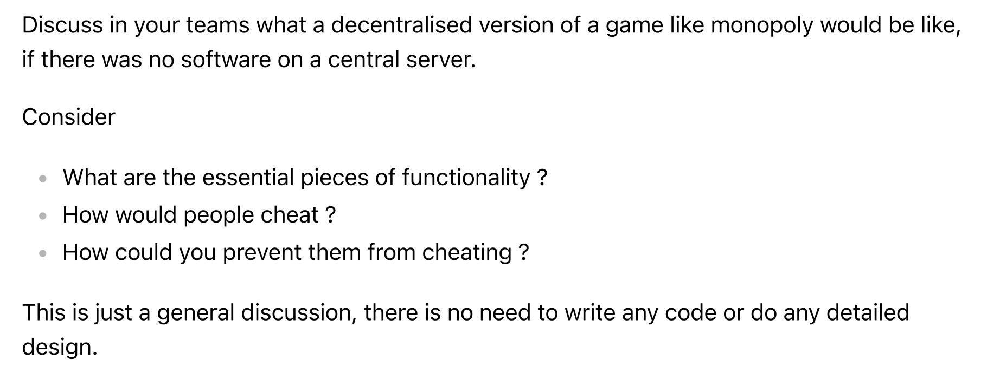

# Overview

---

# Solution

## What are the essencial pieces of functionality?

### __Randomness__

One of the main factors of the Monopoly game resides in the randomness of a die throw. If an action
such as throwing the die during a players turn is centralized, this could increase the liklihood that
a (centralized) party in control of said outcome would find it advantageous to give a preference to one of the players.

Other elements that involve randomness include 2 sets of cards (grouped into Chance & Community Chest). Players pick these cards during certain turns and ensuring that the stack of cards hasn't been manipulated to favour a player over others is important.

### __Trust__

In the game of Monopoly, the role of the "Banker" is responsible for things such as collecting rent from owned properties. The banker is a centralized game could potentially manipulate the rent amount which other players have to pay in order to benefit from a spread. In a distributed public ledger system, such data would be noticed fairly quickly if at all possible (depending on the design of the blockchain).

### __Points of Failure__

One strength that (well built) distributed systems bring is redundancy and a decreased liklihood of failure due to a single weak link or "node".

The analogy in the game of Monopoly is that the Banker is a single point of failure and hence the centralization. Comparitvely, in a decentralized system, the role of the Banker becomes less decessary and the responsibilities are then distributed among all the players via consensus.

### __Attacks__

It is possible that in a decentralized system, the majority of players can collude to disadvantage a single player since there are no centralized authorities such as the Banker. However, given a large enough pool of random players, the liklihood of such an event taking place is smaller.

One way to prevent a 51% attack [2] is introducing external players which are only incentivized to validate and do not play the game. For example, such external players can take a X% of earnings for providing honest answers about what is taking place in the game. They can also put up a stake of in-game dollars which can be taken away if their provide answers against majority of other validators.

---

## Resources and References

1. [Article - 51% Attack](https://www.investopedia.com/terms/1/51-attack.asp)
2. [Podcast - Does Decentralization Reduce The Liklihood of a Monopoly?](https://medium.com/hackernoon/does-decentralization-reduce-the-likelihood-of-a-monopoly-703cb27fd760)

